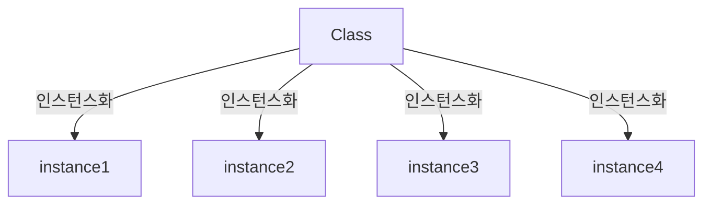

# 6장 객체지향프로그래밍 (1)

> **목차**
> 
> 1. 객체지향언어
> 2. 클래스와 객체
> 3. 변수와 메서드
> 4. 오버로딩
> 5. 생성자
> 6. 변수의 초기화

### 2장 클래스와 객체

1. **클래스**
    1. 객체를 정의해놓은 것
    2. 객체를 생성할 때 사용한다
2. **객체**
    1. 클래스에 정의된 내용대로 메모리에 생성된 것

### 객체와 인스턴스



### 객체의 구성요소, 속성과 기능

1. **property**
    1. 멤버 변수, 특성, 필드, 상태
2. **function**
    1. 메서드, 함수, 행위

### 인스턴스의 생성과 사용

1. 인스턴스는 참조변수를 통해서만 다룰 수 있으며, 참조변수의 타입은 인스턴스의 타입과 일치해야한다
2. 객체 배열 선언
    
    ```java
    Tv[] tvArr= new Tv[3]; // 길이가 3인 Tv타입의 참조변수 배열
    
    tvArr[0]=new Tv();
    tvArr[1]=new Tv();
    tvArr[2]=new Tv();
    
    Tv[] tvArr={new Tv(),new Tv(),new Tv()};
    
    Tv[] tvArr=new Tv[100];
    
    for(int i=0;i<tvArr.length;i++){
    	tvArr[i]=new Tv();
    }
    ```
    
3. 제어자 (**Modifier**)

---

## 3장 변수와 메서드

### **변수**

1. 클래스 변수
2. 인스턴스 변수
3. 지역 변수

### 메서드의 선언과 구현

> **return값의 타입은 반환타입과 일치하거나 적어도 자동 형변환이 가능한 것이어야한다**
> 

### 메서드의 실행 흐름

같은 클래스 내의 메서드끼리는 참조변수를 사용하지 않고도 서로 호출이 가능하지만,
static 메서드는 같은 클래스 내의 인스턴스 메서드를 호출할 수 없다.

→ 당연하다. 객체가 생성되지 않았는데 어찌 인스턴스 메서드를 사용하겠는가?

### JVM의 메모리구조

| 영역 | 설명 |
| --- | --- |
| Method Area | 프로그램 실행 중 어떤 클래스가 사용되면, JVM은 해당 클래스의 클래스 파일을 읽고 분석 후 클래스에 대한 정보(클래스 데이터)를 이곳에 저장. 이 때 클래스의 클래스 변수도 이 영역에 함께 생성 |
| Heap | 인스턴스가 생성되는 공간. 즉 인스턴스 변수들이 생성되는 공간 |
| Call Stack | 메서드의 작업에 필요한 메모리 공간 제공.  |

### 기본형 매개변수와 참조형 매개변수

> **기본형 매개변수(Primitive type) 이면 복사본을 제공

참조형 매개변수 (Reference type)이면 인스턴스의 주소가 복사됨**
> 

C언어에서의 call by value 개념과 pointer를 사용하는 이유와 유사하다.

### 참조형 반환타입

> 반환타입이 참조형이라는 것은 **메서드가 객체의 주소를 반환**한다는 것이다.
> 

### **클래스 메서드 (static 메서드)와 인스턴스 메서드**

> 인스턴스 메서드는 **인스턴스 변수와 관련된 작업**을 하는 , 즉 메서드의 작업을 수행하는데 인스턴스 변수를 필요로 하는 메서드.

클래스 메서드는 **인스턴스 변수와 관련되지 않은 작업**을 하는 메서드.
> 

1. 클래스를 설계할 때, 멤버 변수 중 모든 인스턴스에 공통으로 사용하는 것에 static을 붙인다.
2. 클래스 변수는 인스턴스를 생성하지 않아도 사용할 수 있다.
3. 클래스 메서드는 인스턴스 변수를 사용할 수 없다.
4. 메서드 내에서 인스턴스 변수를 사용하지 않는다면, static을 붙이는 것을 고려한다.

### 클래스 멤버와 인스턴스 멤버간의 참조와 호출

클래스 멤버가 인스턴스 멤버를 참조 또는 호출하고자하는 경우에는 인스턴스를 생성해야함

당연하게도, 인스턴스 멤버가 존재하는 시점에는 이미 클래스 멤버는 존재, 그러나 그 역순은 불가할 수 있음.

---

## 4장 오버로딩

### 오버로딩이란?

> **하나**의 메서드 이름으로 **여러 기능을 구현**하는 것
> 

### 오버로딩의 조건

> **1 . 메서드 이름이 같아야한다.
2 .매개변수의 개수 또는 타입이 달라야한다.**
> 

그리고 오버로딩된 메서드들은 매개변수에 의해서만 구별될 수 있으므로,
반환 타입은 오버로딩을 구현하는데 아무런 영향을 주지 못한다는 것에 주의하자. 

~~→ 이해가 잘 안가는 부분~~

당연하다, 메소드 명과 매개변수의 타입과 개수가 동일한데, 반환타입이 다른 두 메소드가 있다면 컴파일러는 누구를 택하겠는가? 선택할 수 없다.

### 가변인자와 오버로딩 (JDK 1.5 이후 내용이니 꼭 참고바람)

기존에는 메서드의 매개변수 개수가 고정적이었음.

**가변인자** 

```java
public PrintStream printf(String format, Object... args){...};
```

가변인자 외에도 매개변수가 더 있다면, 가변인자를 매개변수 중 가장 마지막에 두어야함.

컴파일러 입장에서 첫번째 이후 들어온 이것이 가변인자인지 아닌지 구별할 방도가 없기 때문.

**가변인자의 원리**

```java
String concatenate (String s1,String s2){...};
String concatenate (String s1,String s2,String s3){...};
String concatenate (String s1,String s2,String s3,String s4){...};

String concatenate (String... s1){...}; //이렇게 가변인자로 간단하게 오버로딩!

System.out.println(concatenate()); //OK
System.out.println(concatenate("a")); //OK
System.out.println(concatenate("a","b")); //OK
System.out.println(concatenate(String[] new{"A","B"})); //OK
```

가변인자는 **내부적으로 배열을 이용**하는 것이다.

그러면 가변인자는 아래와 같이 매개변수의 타입을 배열로 하는 것과 어떤 차이가 있는가?

매개변수의 타입을 배열로하면 반드시 인자가 들어가야한다. 그러나 이 경우에는 빈 인자로 보낼 때의 처리가 불가하기에 불편하다. 

### 가변인자를 오버로딩할 때 주의해야할 사항

가변인자를 선언한 메서드를 오버로딩하면 구분이 안가는 경우가 많으니 유념할 것!

가능하면 가변인자를 사용한 메서드는 오버로딩하지 않는 것이 좋다.

## 5장 생성자

### 생성자란?

> 생성자는 인스턴스가 생성될 때 호출되는 ‘**인스턴스 초기화 메서드**’이다.
생성자는 인스턴스 생성 시 실행되어야할 작업을 위해서 사용됩니다.
> 

**생성자의 조건**

1. 생성자의 이름은 클래스의 이름과 같아야한다.
2. 생성자는 리턴 값이 없다

**연산자 new가 인스턴스를 생성**하는 것이지 생성자가 인스턴스를 생성하는 것이 아니다.

생성자는 단순히 인스턴스 변수들의 초기화에 사용되는 조금 특별한 메서드일 뿐.

```java
Card c=new Card();

// 1. 연산자 new에 의해서 메모리 (heap)에 Card 클래스의 인스턴스가 생성된다.
// 2. 생성자 Card()가 호출되고 수행됨
// 3. 연산자 new의 결과로, 생성된 Card 인스턴스의 주소가 반환되어 참조변수 c에 저장된다.
```

### 기본 생성자( 디폴트 생성자)

> 기본 생성자가 컴파일러에 의해서 추가되는 경우는 **클래스에 정의된 생성자가 하나도 없을 때** 뿐이다.
> 

### 매개변수가 있는 생성자

 

네, 당연하죠

### 생성자에서 다른 생성자 호출하기- this(), this

같은 클래스의 멤버들 간에 서로 호출할 수 있는 것처럼 생성자 간에도 서로 호출이 가능하다!

> 1 . 생성자의 이름으로 클래스 이름 대신 this를 사용한다.
2 . 한 생성자에서 다른 생성자를 호출할 때는 반드시 첫 줄에서만 호출이 가능하다.
> 

생성자에서 다른 생성자를 첫 줄에서만 호출이 가능하도록 한 이유는 생성자 내에서 초기화 작업 도중에 다른 생성자를 호출하게 되면, 호출된 다른 생성자 내에서도 멤버 변수들의 값을 초기화를 할 것이므로 다른 생성자를 호출하기 이전의 초기화 작업이 무의미해질 수 있기 때문이다.

### this

this는 참조변수로 인스턴스 자신을 가리킨다.

하지만, this 를 사용할 수 있는 것은 인스턴스 멤버 뿐이다. static 메서드에서는 인스턴스 멤버들을 사용할 수 없는 것처럼, this 역시 사용할 수 없다. 

### this(), this(매개변수)

생성자, 같은 클래스의 다른 생성자를 호출할 때 사용한다.

### 생성자를 이용한 인스턴스의 복사

> Object 클래스에 정의된 clone 메서드를 이용하면 간단히 인스턴스를 복사할 수 있다.
> 

> 인스턴스를 생성할 때에는 다음의 2가지 사항을 결정해야한다.
> 
> 
> > **1 . 클래스 - 어떤 클래스의 인스턴스를 생성할 것인가?
> 2 .생성자 - 선택한 클래스의 어떤 생성자로 인스턴스를 생성할 것인가?**
> > 

### 6장 변수의 초기화

### 변수의 초기화

> 멤버 변수는 초기화를 하지 않아도 자동적으로 디폴트값으로 초기화가 된다.
그러나 **지역 변수는 사용하기 전에 반드시 초기화**를 해야한다.
> 

### 멤버 변수의 초기화 방법

> **1 . 명시적 초기화
2 . 생성자
3 . 초기화 블럭
    a. 인스턴스 초기화 블럭
    b. 클래스 초기화 블럭**
> 

### 명시적 초기화

간단하고 명료하지만, 복잡한 초기화 작업이 필요할 때는 초기화 블럭 또는 생성자를 사용해야 한다.

### 초기화 블럭

1. 인스턴스 초기화 블럭
2. 클래스 초기화 블럭

클래스 초기화 블럭은 클래스가 메모리에 처음 로딩될 때 **한번만** 수행됨

인스턴스 초기화 블럭은 생성자와 같인 **인스턴스를 생성할 때** 수행됨

인스턴스 초기화 블럭은 모든 생성자에서 공통으로 수행되어야 하는 코드를 넣는데 사용됨.

인스턴스 초기화 블럭은 생성자보다 우선임.

### 멤버변수의 초기화 시기와 순서

| 클래스 변수의 초기화 시점 | 클래스가 로딩될 때 단 한 번 초기화 |
| --- | --- |
| 인스턴스 변수의 초기화 시점 | 인스턴스가 생성될 때마다 각 인스턴스 별로 초기화가 이루어진다 |
| 클래스 변수의 초기화 순서 | 기본값 → 명시적 초기화 → 클래스 초기화 블럭 |
| 인스턴스 변수의 초기화 순서 | 기본값 → 명시적 초기화 → 인스턴스 초기화 블럭 → 생성자 |