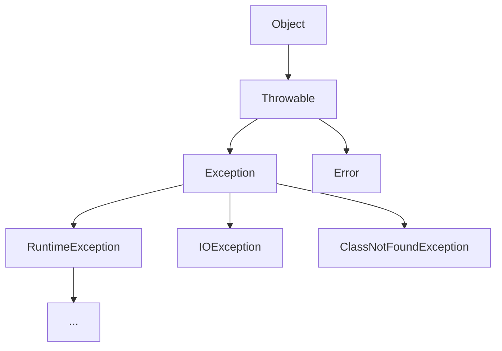

# 8장 예외처리

### 1. 프로그램 오류

**에러의 종류 3가지** 

1. 컴파일 에러
2. 런타임 에러
3. 논리적 에러

자바에서는 실행시 (runtime) 발생할 수 있는 프로그램 오류를 **에러(error)**와 **예외(exception)** 두가지로 구분하였다.

> **에러(error) : 프로그램 코드에 의해서 수습될 수 없는 심각한 오류
예외(exception) : 프로그램 코드에 의해서 수습될 수 있는 다소 미약한 오류**
> 

예시를 들자면, 
에러는 메모리 부족, 스택오버플로우 같은 심각한 것들

### 2. 예외 클래스의 계층구조



모든 예외의 최고 조상은 Exception 클래스이다.

> 1. Exception 클래스와 그 자손들 (RuntimeException 제외)
2. RuntimeException 클래스와 그 자손들
> 

> **Exception 클래스** → 사용자의 실수와 같은 외적인 요인에 의해 발생하는 예외
**RuntimeException 클래스** → 프로그래머에 의해 발생하는 예외
> 

### 3. 예외처리하기 try-catch

> catch 블럭의 괄호 내의 선언된 변수는 catch 블록 안에서만 유효하다. catch 블록 외라면 같은 이름의 변수를 사용해도 되겠지만, 안이라면 에러가 날 것이다.
> 

> 정수를 0으로 나누는 것 → ArithmeticException!
실수를 0으로 나누는 것 → OK!
> 

### 4. try-catch 문에서의 흐름

> **try 블럭 내에서 예외가 발생한 경우

1. 발생한 예외와 일치하는 catch블럭이 있는지 확인
2. 일치하는 catch 블럭이 있으면, catch 블럭 내의 문장을 수행하고 전체 try-catch를 빠져나감.
    만약 일치하는 catch 블럭이 없으면 예외는 처리되지 못하고 뻗음**
> 

### 5. 예외의 발생과 catch 블럭

예외가 발생하면, 발생한 예외에 해당하는 클래스의 인스턴스가 만들어짐.

그리고 해당하는 예외를 처리할 수 있는 try 블럭이 있는지 탐색함. 
instance of 가 true일때까지..

순차적으로 탐색하기에 마지막에 Exception e로 두면 모든 예외를 처리 가능..

**printStackTrace()와 getMessage()**

catch 블럭 내에서 예외 인스턴스 메서드를 통해 예외의 정보를 알 수 있다.

> **printStackTrace(): 예외 발생 당시의 호출 스택에 있었던 메서드의 정보와 예외 메시지를 화면에 출력한다.

getMessage(): 발생한 예외클래스의 인스턴스에 저장된 메시지를 얻을 수 있다.**
> 

추후 오버로딩된 메소드들을 통해 예외 로그를 남기는 방법 또한 학습한다.

**멀티 catch 블럭**

JDK 1.7 부터 catch 블럭을 | 기호를 사용해 하나의 catch 블럭으로 합칠 수 있게 하였고 이것을 멀티 catch 블럭이라한다. 여기서 사용되는 | 은 논리연산자가 아니라 기호이다.

다만 | 로 연결한 예외가 서로 부모 자식관계면 에러가 발생함.

### 6장 예외 발생시키기

키워드 throw를 사용해서 프로그래머가 고의로 예외를 발생시킬 수 있음.

> 먼저, 연산자 new를 통해 발생시키려는 예외 클래스 객체를 만들고
throw를 통해 예외를 던진다
> 

```java
try{
	Exception e= new Exception("고의로 발생시켰음.");
	throw e;}
catch (Exception e){
	e.printStackTrace();
}
```

throw만 하고 catch를 안하면 컴파일 에러가 난다.

그러나 RuntimeException() 클래스에 해당하는 것들은 꼭 catch를 하지 않아도 된다. 왜냐하면 이는 프로그래머가 실수하여 내는 예외이기 때문이다.

### 7장 메서드에 예외 선언하기

```java
void method() throws Exception1,Exception2,Exception3{};
```

만약 throws에 Exception을 둔다면, 자손 타입의 예외까지도 발생할 수 있다는 의미이다.

또한 오버라이딩 조건도 고려해야함 (오버라이딩 했을 시 예외가 더 많아지면 안된다.)

메서드 선언부의 throws에는 반드시 처리되어야할 예외 (보통 Exception 클래스의 자손들 (! RuntimeException))를 써둔다. 

### 8장 finally 블럭

예외의 발생여부에 상관없이 실행되는 코드의 블럭

return을 만나도 finally가 먼저 실행된 후 return한다.

### 9장 try -with - resources 문

try - with -resources

File 입출력 시 사용한다. 왜냐하면 close()도 예외를 발생시킬 수 있기 때문.

**단순 try catch 예제**

```java
try{
	fis=new FileInputStream("score.dat");
	dis=new DataInputStream(fis);
}
catch (IOException e){
	ie.printStackTrace();
}
```

**try- with -resources 예제**

```java
try(FileInputStream fis=new FileInputStream("score.dat");
		DataInputStream dis=new DataInputStream(fis)){
		
		while(true){
			score+=dis.readInt();
			System.out.println(score);
			sum+=score;
		}
}
catch(EOFException e){
	System.out.println("점수의 총합은 "+sum+"입니다.");
}
catch(IOException ie){
	ie.printStackTrace();
}
```

try-with-resources 문의 괄호 안에 객체를 생성하는 문장을 넣으면, 이 객체는 따로 close()를 호출하지 않아도 try 블럭을 벗어나는 순간 자동적으로 close()가 호출된다.

다음 순은 catch 블럭 → finally 블럭

이처럼 try-with-resources 문에 의해 자동으로 객체의 close()가 호출될 수 있으려면, 클래스가 AutoCloseable이라는 인터페이스를 구현한 것이어야만 한다.

**Exception 예외** → 반드시 처리해주어야할 checked 예외

**RuntimeException 예외** → 예외처리 여부를 선택할 수 있는 unchecked 예외

### 11장 예외 되던지기

한 메서드에서 발생할 수 있는 예외가 여럿일 경우, 예외가 발생한 메서드와 호출한 메서드 둘 모두에서 처리가 가능하다..

### 12장 연결된 예외

한 예외가 다른 예외를 발생시킬 수 있는 것을 말한다.

**사용하는 이유**

1. 여러가지 예외를 하나의 큰 분류의 예외로 묶어서 다루기 위해서이다.
2. checked 예외를 unchecked 예외로 바꿀 수 있게 하기 위해서이다.